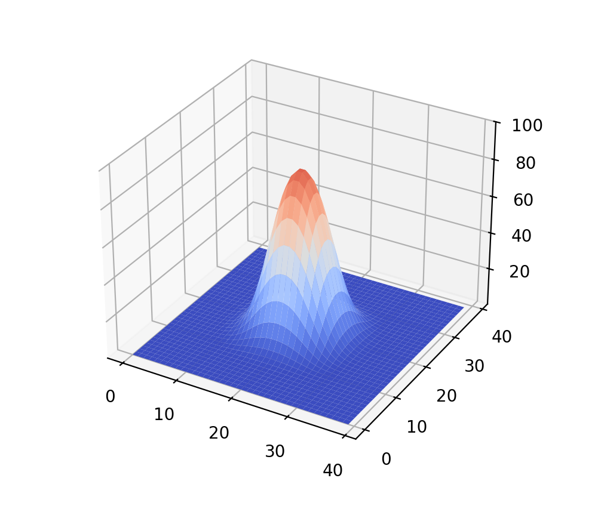
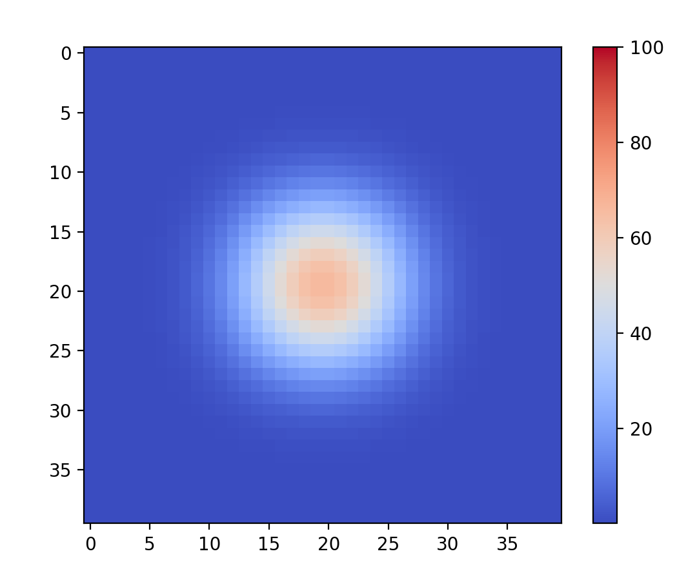

# FO24Z-gr34

# Basic usage
1. install all required python dependencies with command
pip install -r requirements.txt

2. run application with right configuration file
python heat_equation.py --config <configuration_file>

in case of our base configuraiton, run
python heat_equation.py --config config.json

# Configuration
Config.json file allows to configure:
• wait: time interval between updates  
• x_size, y_size: domain dimensions  
• T: total simulation duration  
• dt: time step used in updates  
• plots: number of plot outputs through out simulation
• points: coordinates with initial temperature values 
• default_val: default temperature of points

# Used numeric methods:
- FTCS (Forward-Time Centered-Space)
    - simple to implement, no need to solve system of equations
    - has a stability condition - delta t has to be small enough with regards to delta x
    - may be inacurate for large time steps

- BTCS(Backward-Time Centered-Space)
    - next time step is computed by solving a system of linear equations
    - always stable
    - more acurate than FTCS with large time steps
    - more computationally expensive

# Results:
3D simulation:

2D simulation

# Sources:
- (section with heat equation) https://en.wikipedia.org/wiki/Finite_difference_method